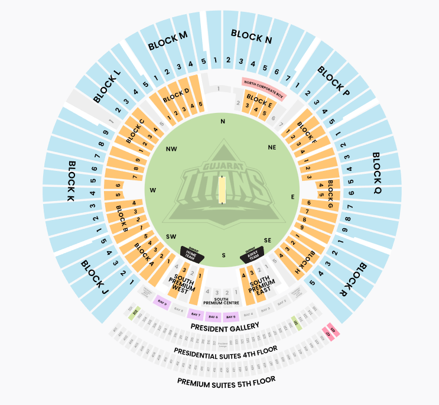

# StadiumFlow

**StadiumFlow** is an advanced, autonomous 3D Digital Twin simulation architected natively for the massive 63-acre Narendra Modi Stadium in Ahmedabad. By bypassing traditional static stadium maps, the engine deploys a high-performance **MapLibre GL JS** geometric environment overlaid on real-world satellite arrays seamlessly rendering multiple topological structures simultaneously. 



## Core Capabilities

### 🏢 Immersive 3D Spatial Matrix 
StadiumFlow constructs colossal 3D structural extrusions directly dynamically utilizing IMDF (Indoor Mapping Data Format). Fans can navigate via dual z-indexed planes: isolating the L1 Seating Bowl from the intricate L0 Amenities Concourse visually beneath them!

### 🧑‍🤝‍🧑 Multi-Agent Ecosytem (Live Crowd Simulator)
Never traverse an empty stadium again. The UI houses an isolated **Headless Simulation Thread** natively bridging 10 unique ghost-personas directly into the DOM loop without touching React constraints. Every 150ms, the engine algorithms propel AI users naturally across sweeping circular paths mirroring pure real-life human crowd traffic.

### 📍 Intelligent Pathfinding & Constraints 
All spatial navigation mathematically intercepts an R=300 Commute Ring strictly limiting fan movement exactly to geometric concourse layouts without breaking boundaries over the physical pitch! StadiumFlow instantly intercepts random pathing vectors, throwing automated Lock-out Overrides mathematically enforcing Ticket Check-in verification completely locally.


## 📂 Project Architecture Documentation

To dive deeper into the architectural blueprint and computational logic governing the StadiumFlow 3D platform natively, explore the extensive developer repositories below:

- **[High-Level Design (HLD)](./docs/HLD.md)** - Explores the comprehensive infrastructure scaling 3D WebGL data parsing seamlessly into mobile wrappers natively.
- **[Low-Level Design (LLD)](./docs/LLD.md)** - A technical mapping examining the mathematical arc geometries, simulation loops, grouping functions, and native data schema configurations.
- **[Aesthetic Design Document](./docs/design.md)** - Breakdown of the visual ecosystem and "Dark Dynamic" UI philosophy targeting high-contrast spatial geometries natively.
- **[Project Synopsis](./docs/description.md)** - Executive Summary tracking the core use-case implementations defining the "Smart Fan" digital era.

---

### Quick Start
To launch the MapLibre 3D Sandbox natively in Expo:
```bash
cd frontend
npm run start:ui
```
