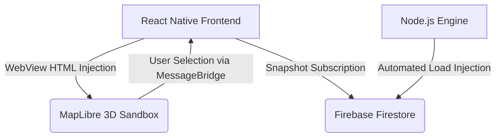

# High Level Design (HLD)

The StadiumFlow architecture executes strict segregation between Data Automation, State Storage, and 3D Visualization via a serverless micro-monorepo. 

## Architectural Diagram Foundation

## System Components
### 1. The Rendering Client (Expo / React Native)
- Acts as the primary Orchestrator securely managing Authentication and visual logic. 
- Defers all physically complex Map GIS vector rendering into a tightly bound `<WebView>` bridge resolving fatal Node dependency collisions securely for Open Source Map providers.

### 2. The Cloud State (Firebase Firestore)
- The intermediary NoSQL real-time document store.
- Replaces complex WebSocket scaffolding with localized caching pipelines maintaining seamless connection regardless of network density inside physical stadiums.

### 3. The Analytics Engine (Node.js Workspace)
- Responsible for injecting "Reality" securely. It simulates varying match-day states natively (e.g. "Early Arrival", "Half-time Rush") shifting crowd density flags recursively without burdening the Client OS.
