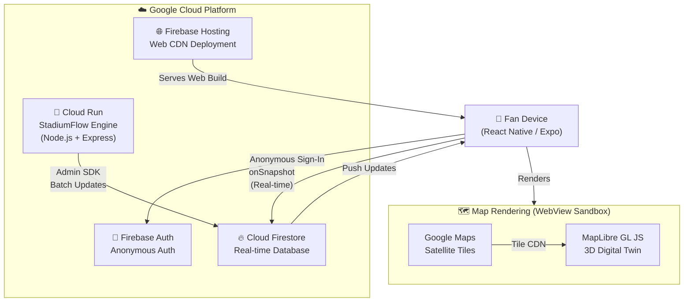

# High-Level Design (HLD) — StadiumFlow

## Overview

StadiumFlow is a **real-time crowd intelligence platform** built on a three-tier serverless architecture: a React Native mobile client, a Google Cloud Run backend engine, and a Firebase data layer. The system detects crowd density at stadium amenities and reroutes fans to uncongested alternatives.

---

## System Architecture



---

## Component Responsibilities

### 1. 📱 React Native Frontend (Expo)
The orchestration layer managing auth, state, and UI rendering.

| Sub-component | Responsibility |
|--------------|---------------|
| `App.tsx` | Root router — auth state → view transitions |
| `StadiumMap.tsx` | 3D map host with WebView/iframe bridge |
| `Dashboard.tsx` | Pre-entry command center, ticket scan |
| `RoleSelector.tsx` | Simulation role assignment |
| `TrafficStatusBar.tsx` | Real-time gate congestion indicator |

**Key patterns:**
- Firebase `onSnapshot` listeners maintain live sync (no polling)
- `useCallback` / `useMemo` minimize unnecessary re-renders
- WebView `postMessage` bridge connects React state to MapLibre GL JS
- `useRef` for ghost simulation — bypasses React render cycles for 150ms animation ticks

### 2. ☁️ Cloud Run Backend Engine (Node.js + Express)
The server-side scenario engine and REST API.

| Endpoint | Method | Purpose |
|---------|--------|---------|
| `/` | GET | Health check + service status |
| `/health` | GET | Kubernetes/Cloud Run liveness probe |
| `/api/seed` | GET | One-time Firestore schema initialization |
| `/api/zones` | GET | Fetch all stadium zone statuses |
| `/api/zones/:id/status` | PATCH | Update a specific zone's congestion |
| `/api/scenario/end-match` | POST | Trigger mass crowd reshuffling scenario |

**Security stack:** `helmet` → `cors` → `express-rate-limit` → route handler

### 3. 🔥 Cloud Firestore (Real-time Database)

| Collection | Schema | Access |
|-----------|--------|--------|
| `stadium_zones` | `{ type, capacity, current_pings, coordinates, status }` | Read: auth users; Write: Admin SDK only |
| `users` | `{ tester_id, uid, hasEntered, current_coords, notification }` | Read: auth users; Write: own document |
| `tickets` | `{ ticketId, ownerName, seatInfo, target_coords, entry_gate }` | Read: auth users; Write: Admin SDK only |

### 4. 🗺️ MapLibre GL JS 3D Engine (WebView Sandbox)

Renders the full 3D digital twin inside an HTML `<WebView>` or `<iframe>`:

| Layer ID | Type | Data Source | Purpose |
|---------|------|-------------|---------|
| `satellite` | raster | Google Maps tile CDN | Base satellite imagery |
| `room-extrusion` | fill-extrusion | `stadium-data` GeoJSON | 3D seating blocks (Level 1) |
| `hotspot-points` | circle | `stadium-data` GeoJSON | Amenity status dots (Level 0) |
| `hotspot-labels` | symbol | `stadium-data` GeoJSON | Amenity name labels |
| `ghost-layer` | circle | `ghost-agents` GeoJSON | Crowd simulation agents |
| `active-user-point` | circle | `active-user` GeoJSON | Fan's blue dot |
| `navigation-line` | line | `navigation-path` GeoJSON | GPS route ribbon |

---

## Data Flow

```
Fan opens app
     │
     ▼
Firebase Anonymous Auth ──► uid assigned
     │
     ▼
Firestore onSnapshot ──► stadiumZones[], allUsers[] → React state
     │
     ▼
StadiumMap renders ──► WebView loads MapLibre HTML
     │
     ▼
MapLibre fires 'idle' ──► MAP_READY via postMessage ──► isMapReady = true
     │
     ▼
React Effects execute:
  • Layer visibility (Level 0 / Level 1)
  • Navigation path GeoJSON update
  • User blue dot + camera flyTo
  • Ghost agents interval (150ms tick)
     │
     ▼
Fan taps amenity ──► HOTSPOT_SELECTED via postMessage ──► HUD overlay
     │
     ├─► Status = red ──► Vibration + Congestion Dialog + Reroute button
     └─► Status = green/orange ──► Navigate HUD with GPS route
```

---

## Deployment Architecture

```
GitHub Repository
     │
     ▼ (Manual / CI)
┌────────────────────────────────────────┐
│  Google Cloud Run (asia-south1)        │
│  • Container: node:18-alpine           │
│  • Non-root user (appuser:1001)        │
│  • Auto-scales 0 → N replicas         │
│  • HTTPS-only, managed TLS            │
└────────────────────────────────────────┘
     │ Admin SDK (Application Default Credentials)
     ▼
┌────────────────────────────────────────┐
│  Cloud Firestore                       │
│  • Security rules: auth + role-based  │
│  • Real-time listeners (gRPC stream)  │
└────────────────────────────────────────┘
     │ onSnapshot (WebSocket-like)
     ▼
┌────────────────────────────────────────┐
│  Firebase Hosting (CDN)                │
│  • Expo web build                      │
│  • Auto SSL, global edge network      │
└────────────────────────────────────────┘
```

---

## Non-Functional Requirements

| Property | Implementation |
|---------|---------------|
| **Latency** | Firestore `onSnapshot` delivers updates < 300ms globally |
| **Scalability** | Cloud Run auto-scales; Firestore handles 1M+ concurrent listeners |
| **Security** | Helmet, CORS, rate limiting, Firestore rules, non-root containers |
| **Accessibility** | WCAG 2.1 AA — semantic roles, live regions, 44px+ touch targets |
| **Testability** | 14 backend unit tests, 3 frontend test suites, TypeScript strict mode |
